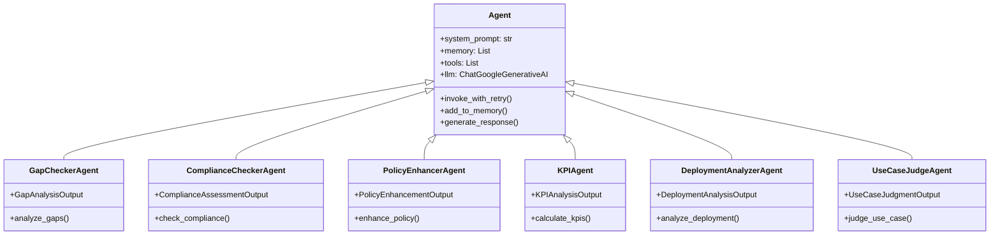

# Documentation de l'Architecture Multi-Agents et Système de Recherche de Standards avec Versioning

## Table des Matières

1. [Vue d'ensemble du Système](#vue-densemble-du-système)
2. [Architecture Multi-Agents](#architecture-multi-agents)
3. [Agents Spécialisés](#agents-spécialisés)
4. [Système de Recherche Web de Standards](#système-de-recherche-web-de-standards)
5. [Système de Versioning](#système-de-versioning)
6. [Pipelines d'Orchestration](#pipelines-dorchestration)
7. [Diagrammes UML](#diagrammes-uml)
8. [Flux de Données](#flux-de-données)

## Vue d'ensemble du Système

Le système GRC (Gouvernance, Risque et Conformité) Assistant est une plateforme sophistiquée utilisant une architecture multi-agents pour l'évaluation des politiques de sécurité et l'analyse des cas d'usage dans le secteur bancaire et financier.

### Architecture Globale


## Architecture Multi-Agents

### Hiérarchie des Agents



## Agents Spécialisés

### 1. Agents d'Évaluation de Politiques

#### Agent de Vérification des Lacunes (GapCheckerAgent)
- **Objectif** : Identifier les éléments manquants dans les politiques de sécurité par rapport aux standards
- **Spécialisation** : Analyse comparative détaillée entre politiques et standards de référence
- **Sortie structurée** : Classification (GOOD/MISSING/NON_COMPLIANT), lacunes identifiées, justification

#### Agent de Vérification de Conformité (ComplianceCheckerAgent)
- **Objectif** : Évaluer le niveau de conformité des politiques aux standards de sécurité
- **Spécialisation** : Analyse de conformité réglementaire (PCI-DSS, SOX, Basel III)
- **Sortie structurée** : Score de conformité, problèmes identifiés, recommandations

#### Agent d'Amélioration de Politiques (PolicyEnhancerAgent)
- **Objectif** : Proposer des améliorations concrètes pour les politiques existantes
- **Spécialisation** : Génération de contenu amélioré basé sur les meilleures pratiques
- **Sortie structurée** : Contenu amélioré, changements apportés, justification

### 2. Agents d'Analyse de Cas d'Usage

#### Agent KPI (KPIAgent)
- **Objectif** : Calculer et analyser les indicateurs de performance de sécurité
- **Spécialisation** : Métriques bancaires et financières spécialisées
- **KPIs analysés** :
  - Efficacité de gestion des vulnérabilités
  - Temps moyen de détection (MTTD) et de réponse (MTTR)
  - Taux de détection d'anomalies transactionnelles
  - Score de sécurité des transactions
  - Disponibilité système (99,9%+ requis)
  - Efficacité de détection de fraude


#### Agent d'Analyse de Déploiement (DeploymentAnalyzerAgent)
- **Objectif** : Évaluer la faisabilité et les aspects d'implémentation des cas d'usage
- **Spécialisation** : Considérations spécifiques au secteur bancaire
- **Analyse** :
  - Score de faisabilité (0-100)
  - Exigences réglementaires bancaires
  - Intégration avec systèmes bancaires centraux
  - Estimation temporelle et ressources nécessaires
  - Facteurs de risque et stratégies de mitigation

#### Agent de Jugement de Cas d'Usage (UseCaseJudgeAgent)
- **Objectif** : Évaluer la qualité et l'efficacité des cas d'usage de sécurité
- **Spécialisation** : Alignement avec standards et politiques de sécurité
- **Évaluation** :
  - Score d'efficacité
  - Alignement avec standards et politiques
  - Impact sécuritaire global
  - Lacunes identifiées et suggestions d'amélioration

## Système de Recherche Web de Standards

### Architecture du Traceur de Standards


### Processus de Récupération Web


## Système de Versioning

### Gestionnaire de Versions de Standards

Le `StandardsVersionManager` gère les différentes versions des standards de sécurité avec les fonctionnalités suivantes :

#### Fonctionnalités Principales

1. **Ajout de Nouvelles Versions**
   - Génération automatique d'ID de version
   - Métadonnées de version (timestamp, source, description)
   - Calcul de similarité avec versions existantes

2. **Suivi des Changements**
   - Détection automatique des modifications
   - Comparaison sémantique entre versions
   - Génération de rapports de changements

3. **Historique des Versions**
   - Stockage persistant des versions
   - Récupération de l'historique complet
   - Navigation entre versions


### Algorithme de Détection de Changements


## Pipelines d'Orchestration

### Pipeline d'Évaluation de Politiques


### Pipeline de Traitement de Cas d'Usage


## Diagrammes UML

### Diagramme de Classes - Système de Versioning


### Diagramme de Séquence - Évaluation de Politique


## Flux de Données

### Architecture de Données Globale


### Flux de Traitement des Standards


## Configuration et Déploiement

### Variables d'Environnement Requises

```bash
# Configuration LLM
GEMINI_API_KEY=your_gemini_api_key

# Configuration Base de Données
STANDARDS_PATH=./db/llamaindex_store_standards
POLICIES_PATH=./db/llamaindex_store_policies
STANDARDS_VERSIONS_PATH=./db/standards_versions
STANDARDS_CHANGES_PATH=./db/standards_changes

# Configuration Embeddings
EMBEDDING_MODEL=BAAI/bge-m3
SIMILARITY_THRESHOLD=0.75

# Configuration API
API_HOST=0.0.0.0
API_PORT=8000
```

### Architecture de Déploiement


## Conclusion

Cette architecture multi-agents offre une solution robuste et extensible pour l'évaluation automatisée des politiques de sécurité et l'analyse des cas d'usage dans le secteur bancaire. Le système de versioning des standards assure une veille technologique continue et maintient la conformité aux dernières exigences réglementaires.

Les points forts du système incluent :

1. **Modularité** : Chaque agent est spécialisé dans une tâche spécifique
2. **Extensibilité** : Nouveaux agents facilement intégrables
3. **Robustesse** : Gestion d'erreurs et retry automatique
4. **Performance** : Traitement parallèle et mise en cache
5. **Conformité** : Adaptation spécifique aux exigences bancaires
6. **Traçabilité** : Versioning complet des standards et changements

Cette documentation technique constitue le livrable pour la compréhension et la maintenance du système GRC Assistant.
